# 🚀 Automatic Build and Deploy Setup Guide

## Overview

This guide will help you set up automatic build and deployment triggered by successful compiles. Every time you push to the main branch or create a pull request, the system will:

1. ✅ **Run Tests** - Execute all test suites
2. 🏗️ **Build Assets** - Compile web assets and XCFramework
3. 🚀 **Deploy** - Automatically deploy to Vercel
4. 📱 **Generate Artifacts** - Create downloadable XCFramework for iOS/watchOS

## 🔧 Required Setup

### 1. GitHub Secrets Configuration

You need to add these secrets to your GitHub repository:

**Go to:** `Settings` → `Secrets and variables` → `Actions`

**Add these secrets:**

```bash
VERCEL_TOKEN=your_vercel_token_here
VERCEL_PROJECT_ID=your_project_id_here  
VERCEL_ORG_ID=your_org_id_here
```

### 2. Get Vercel Credentials

**Install Vercel CLI and get your credentials:**

```bash
# Install Vercel CLI
npm install -g vercel

# Login to Vercel
vercel login

# Link your project
vercel link

# Get your credentials
vercel env ls
```

**Or get them from Vercel Dashboard:**
- Go to [vercel.com](https://vercel.com) → Your Project → Settings
- **Project ID**: Found in General settings
- **Team ID**: Found in General settings (this is your ORG_ID)
- **Token**: Create in Account settings → Tokens

### 3. Environment Protection Rules

**Set up environment protection:**

1. Go to `Settings` → `Environments`
2. Create `production` environment
3. Add protection rules:
   - ✅ Require reviewers (optional)
   - ✅ Wait timer (optional)
   - ✅ Restrict to main branch

## 🔄 Workflow Triggers

### Automatic Triggers

**✅ Push to Main Branch:**
- Runs tests
- Builds XCFramework
- Deploys to production
- Updates live site

**✅ Pull Request:**
- Runs tests
- Creates preview deployment
- Comments PR with preview URL

**✅ Manual Trigger:**
- Use `workflow_dispatch` in GitHub Actions tab

### Build Process

```mermaid
graph TD
    A[Push/PR] --> B[Run Tests]
    B --> C{Tests Pass?}
    C -->|Yes| D[Build Assets]
    C -->|No| E[❌ Fail]
    D --> F[Build XCFramework]
    F --> G{Main Branch?}
    G -->|Yes| H[Deploy to Production]
    G -->|No| I[Deploy Preview]
    H --> J[✅ Success]
    I --> J
```



## 📱 What Gets Deployed

### Web Assets
- `dashboard.html` - Main dashboard
- `api/` - Serverless functions
- `vercel.json` - Configuration
- `package.json` - Dependencies

### iOS/watchOS Artifacts
- `Shared.xcframework` - Downloadable for Xcode projects
- Available for 14 days after build

## 🌐 Deployment URLs

**Production:** `https://mebeatme.ready2race.run`
**Preview:** Generated per PR (commented automatically)

## 🔍 Monitoring Deployments

### GitHub Actions Tab
- View build status
- Download artifacts
- See deployment logs

### Vercel Dashboard
- Monitor function performance
- View deployment history
- Check error logs

## 🛠️ Troubleshooting

### Common Issues

**❌ "VERCEL_TOKEN not found"**
- Add `VERCEL_TOKEN` secret to GitHub repository
- Ensure token has correct permissions

**❌ "Tests failing"**
- Check test logs in Actions tab
- Fix failing tests before deployment

**❌ "Build artifacts missing"**
- Ensure `dist/` folder is created
- Check file paths in workflow

**❌ "Deployment failed"**
- Check Vercel project settings
- Verify domain configuration

### Debug Commands

```bash
# Test locally
npm run build
npm run deploy

# Check Vercel status
vercel ls

# View logs
vercel logs
```

## 🎯 Benefits

### ✅ Automatic Quality Assurance
- Every commit is tested
- Only successful builds deploy
- No broken code reaches production

### ✅ Fast Feedback Loop
- Immediate test results
- Preview deployments for PRs
- Quick iteration cycles

### ✅ Professional Workflow
- Consistent deployment process
- Artifact management
- Environment protection

### ✅ Zero Manual Work
- No manual deployment steps
- Automatic artifact generation
- Self-healing deployments

## 🚀 Next Steps

1. **Add GitHub Secrets** (required)
2. **Test the Workflow** (push a small change)
3. **Monitor First Deployment** (check Actions tab)
4. **Verify Live Site** (visit production URL)

---

**🎉 Once configured, every successful compile will automatically build and deploy your MeBeatMe app!**

**🔗 Your app will be live at:** `https://mebeatme.ready2race.run`
